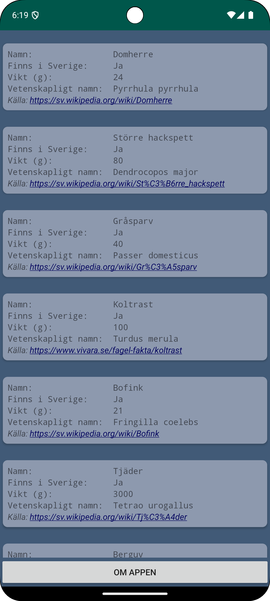
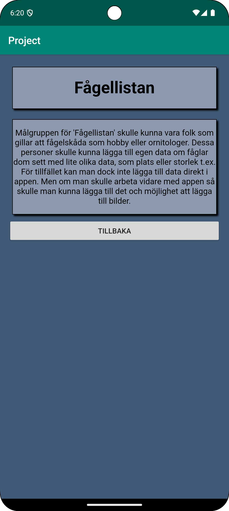

# Rapport Oskar Steise

- La till data i databasen - gjorde en lista med fåglar och lite information om dem
- La till JsonTask.java och kopierade den givna koden
- Skapade en klass för arraylista 'Birds' och angav variablerna som ska finnas i den
```
private String name;
private String location;
private int weight;
private String latin;
private String wikiLink;

public Birds(String n, String l, int h, String m, String w) {
    name = n;
    location = l;
    weight = h;
    latin = m;
    wikiLink = w;
}
```
- Skapade getters till variablerna, jag la även till texten som ska stå i appen och formaterade texterna 
så att variabeln ska skrivas ut efter 30 tecken. 
```
public String getName() {
        return String.format("%-20s %-30s", "Namn:", name);
}
public String getWeight() {
    return String.format("%-20s %-30s", "Vikt (g):", weight);
}
```
- La till recyclerview i layout
- Skapade recycler_view_row.xml som innehåller textviews för varje nod i datan och gav alla textviews ID:n för att kunna presentera datan.
I exemplet nedanför kan man se textviewen som kommer att innehålla information om 'location'.
```
<TextView
    android:id="@+id/locationView"
    android:layout_width="match_parent"
    android:layout_height="wrap_content"
    app:layout_constraintBottom_toTopOf="@id/weightView"
    app:layout_constraintLeft_toLeftOf="parent"
    app:layout_constraintRight_toRightOf="parent"
    app:layout_constraintTop_toBottomOf="@+id/textView"
    android:typeface="monospace"/>
```
- La till RecyclerViewAdapter där texterna som ska finnas i dom olika elementen hämtas och där ID:n från layouts hämtas. 
```
@Override
public void onBindViewHolder(@NonNull RecyclerViewAdapter.MyViewHolder myViewHolder, int position) {
    myViewHolder.textView.setText(birdList.get(position).getName());
    myViewHolder.locationView.setText(birdList.get(position).getLocation());
    myViewHolder.weightView.setText(birdList.get(position).getWeight());
    myViewHolder.latinView.setText(birdList.get(position).getLatin());
    myViewHolder.wikiView.setText(birdList.get(position).getWikiLink());
}
    
public static class MyViewHolder extends RecyclerView.ViewHolder {

    TextView textView;
    TextView locationView;
    TextView weightView;
    TextView latinView;
    TextView wikiView;


    public MyViewHolder(@NonNull View itemView) {
        super(itemView);

        textView = itemView.findViewById(R.id.textView);
        locationView = itemView.findViewById(R.id.locationView);
        weightView = itemView.findViewById(R.id.weightView);
        latinView = itemView.findViewById(R.id.latinView);
        wikiView = itemView.findViewById(R.id.wikiView);
    }
}
```
- Gav permission till internet
- Gjorde wikipedia länkarna klickbara, ändrade även färgen på dem och gjorde dem kursiva.
```
    android:autoLink="web"
    android:textColorLink="#03045e"
    android:textStyle="italic"
```
- Snyggade till layout för text. Ändrade även till mono typsnitt främst för att få String.format att se snyggt ut. 
```
    android:typeface="monospace"
```
- Gjorde hörnen på CardViews rundade och la till elevation och kompatibel padding för skuggning
```
    app:cardCornerRadius="8dp"
    app:cardElevation="2dp"
    app:cardUseCompatPadding="true"
```
- La till en knapp som är tänkt att gå till 'About'-sidan och gav den ett ID
- Skapade SecondActivity och layout-fil och la till den i AndroidManifest
```
    <activity
        android:name=".SecondActivity"
        android:exported="false" />
```
- Hittade knappen i MainActivity.java och skapade en clicklistener som tar användaren till SecondActivity (about-sidan)
```
    // hitta knappen
    Button button = findViewById(R.id.myButton);

    // skapa clicklistener
    button.setOnClickListener(new View.OnClickListener() {
        @Override
        public void onClick(View view) {
            // skapa en intent för att öppna SecondActivity
            Intent intent = new Intent(MainActivity.this, SecondActivity.class);

            // starta SecondActivity
            startActivity(intent);
        }
    });
```
- La till knapp i SecondActivity och skapade en clicklistener för att komma tillbaka till MainActivity. 
(på samma sätt som ovan fast SecondActivity är utbytt till MainActivity)
- Stylade SecondActivity så att den liknar MainActivity
- Skapade en html sida som innehåller information om appen
- Skapade assets folder och la in html-fil
- Skapade en webview i activity_second.xml och gav den ett ID
- Gjorde stegen som krävs i SecondActivity för att kunna ladda den interna hemsidan i WebViewen.
```
    // hitta webview
    WebView webView = findViewById(R.id.webView);
    // koppla webviewclient till webview
    webView.setWebViewClient(new WebViewClient());
    // hämta inställningar för webview
    WebSettings webSettings = webView.getSettings();
    // aktivera javascript
    webSettings.setJavaScriptEnabled(true);
    // ladda in intern webbsida
    webView.loadUrl("file:///android_asset/about.html");
```




